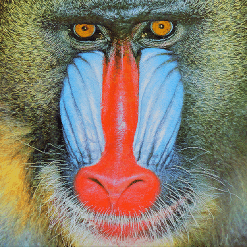
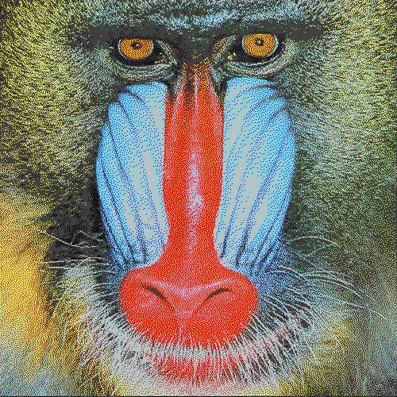
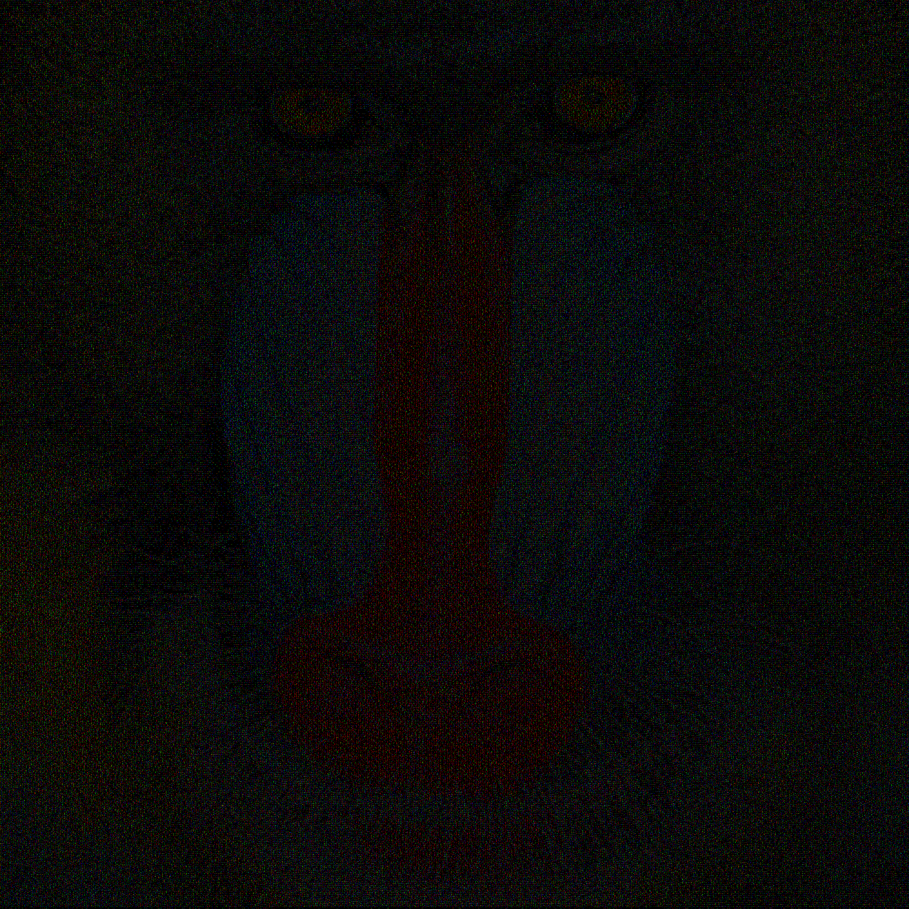
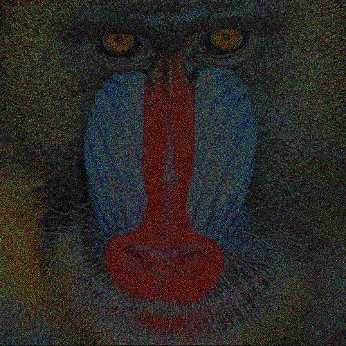
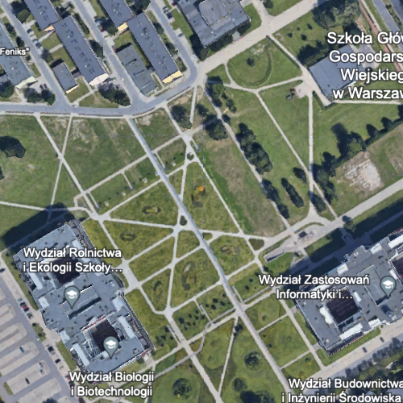
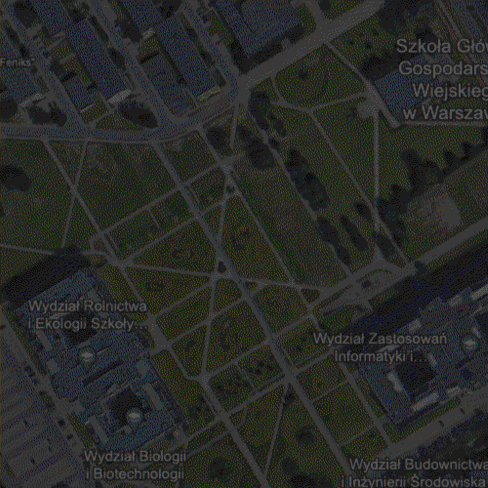
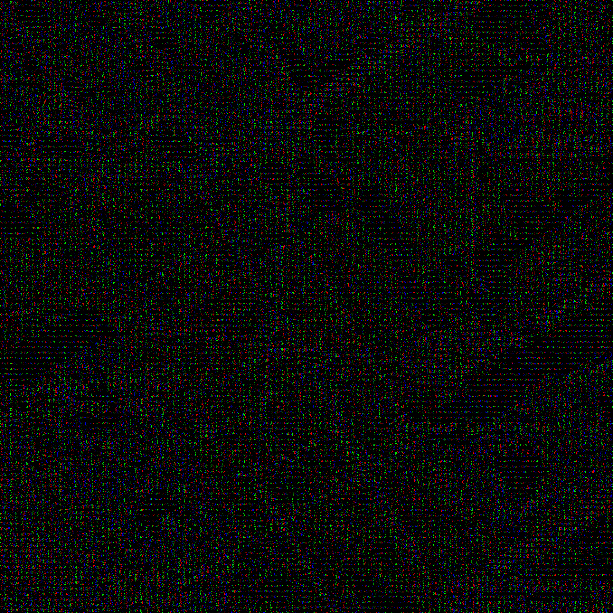
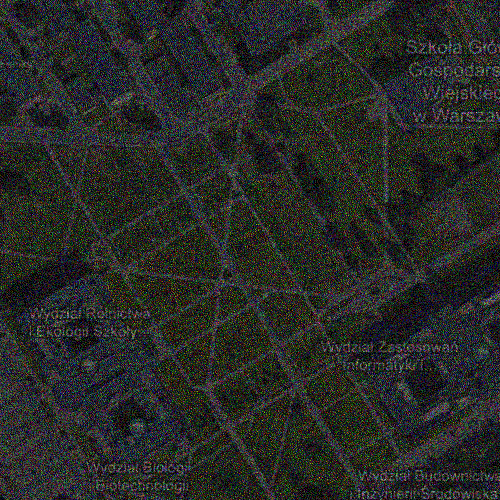
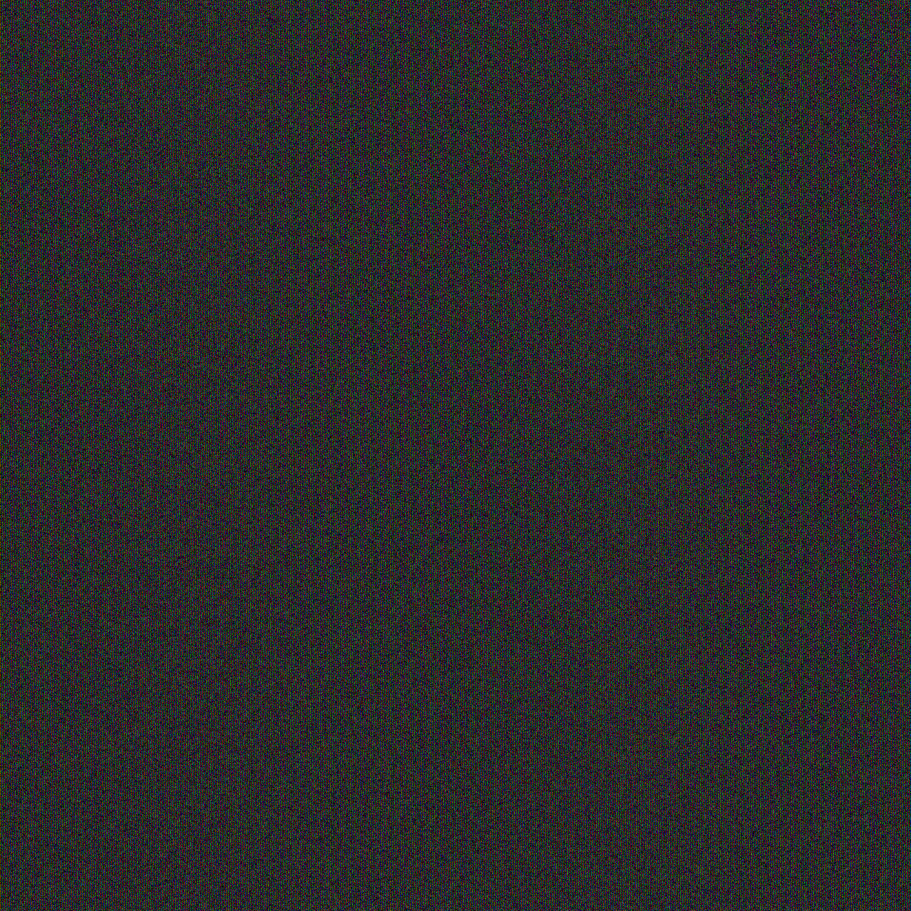
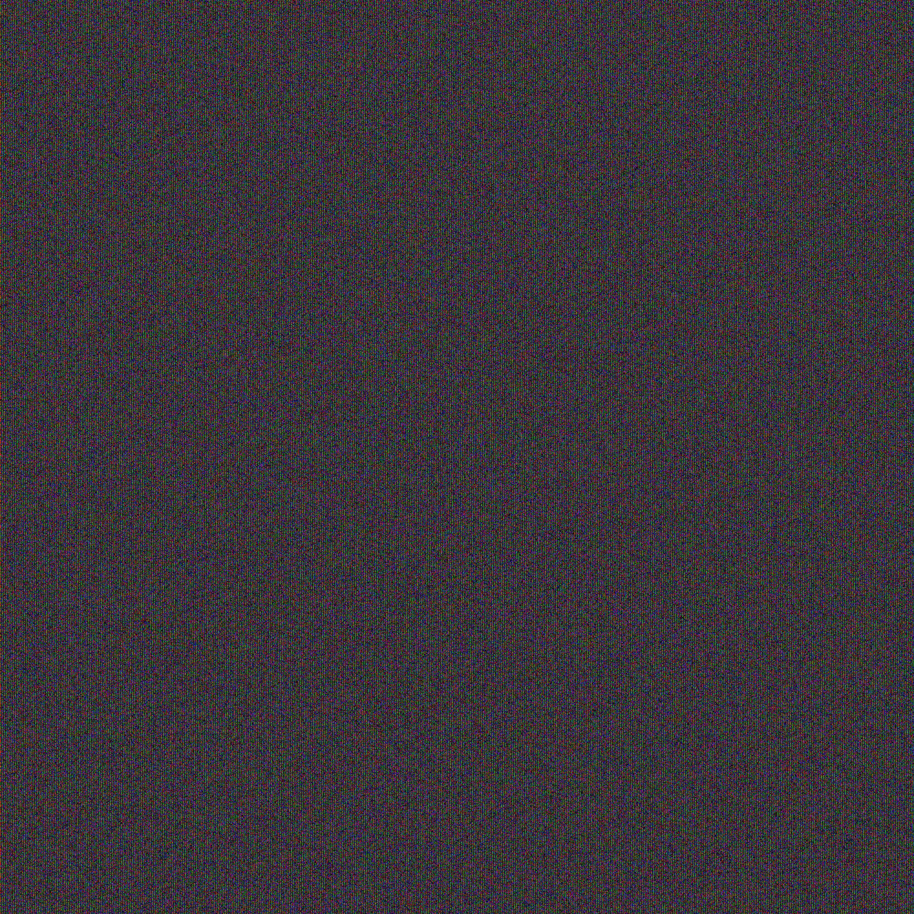

# Visual Cryptography for Color Images

## Wprowadzenie
Kryptografia wizualna jest obszarem kryptografii, który koncentruje się na kodowaniu i dekodowaniu informacji wizualnej. W przeciwieństwie do tradycyjnych metod kryptografii, które opierają się na przekształceniach matematycznych, kryptografia wizualna wykorzystuje obrazy, aby ukryć i przekazać tajne informacje. Technika ta pozwala na podzielenie obrazu na kilka warstw (tzw. udziałów), które indywidualnie nie ujawniają żadnych informacji, ale po ich odpowiednim połączeniu odtwarzają oryginalny obraz.
Jednym z najprostszych przykładów kryptografii wizualnej jest schemat 2-out-of-2. Oryginalny obraz jest podzielony na dwa udziały. Oba udziały wyglądają jak losowe szumy, ale nałożone na siebie tworzą czytelny obraz. Dzięki temu, nawet jeśli jeden udział zostanie przechwycony, bez drugiego nie można odtworzyć oryginalnej informacji.

## Opis Projektu
Wykorzystana przez nas metoda kryptografii wizualnej polega na podziale obrazka na dwa, częściowo losowe, nieczytelne obrazy, które po odpowiednim nałożeniu na siebie, odtwarzają oryginalny obraz. Ta technika, zwykle stosowana do obrazów binarnych (czerń i biel), została tutaj rozszerzona na kolorowe zdjęcia, zwiększając tym samym pulę obrazów możliwych do zakodowania. Nasz projekt wykorzystuje paletę kolorów RGB oraz schemat kryptograficzny (2, 2), który wymaga obu części do odszyfrowania obrazu.

### Wykorzystana metoda
Wykorzystana przez nas metoda bazuje na tej opisanej w
> Color Visual Cryptography with Completely Randomly Coded Colors, Arkadiusz Orłowski & Leszek J. Chmielewski[**<sup>[1]</sup>**](#source1)

## Instalacja
```bash
git clone https://github.com/AdamRopelewski/VisualCryptographyForColorImages.git
cd VisualCryptographyForColorImages
pip install -r requirements.txt
```

## Użycie
Po zainstalowaniu wymaganych modułów uruchom program gui.py przy użyciu pythona.
```bash
python gui.py
```

### Szyfrowanie Obrazu
* Zaznacz opcje "Encode" naciśnij przycisk "Start".
* Następnie wskaż plik wejściowy i zatwierdź.
* Po zakończeniu wyświeli się komunikat o czasie trwania.
* Użyj przycisku "Open output folder", aby otworzyć folder z plikami wynikowymi.

### Deszyfrowanie Obrazu
* Zaznacz opcje "Decode" naciśnij przycisk "Start". 
* Następnie wskaż dwa pliki wejściowowe (uzyskane w kroku Encode) i zatwierdź.
* Po zakończeniu wyświeli się komunikat o czasie trwania.
* Użyj przycisku "Open output folder", aby otworzyć folder z plikami wynikowymi.

## Przykładowe obrazy
<div width="100%">
    <table width="100%" align="center">
        <tr>
            <th colspan="2">Obraz wejściowy - Mandryl</th>
        </tr>
        <tr>
            <td colspan="2"></td>
        </tr>
    </table>
    <table width="100%" align="center">
        <tr>
            <th width="50%">Zmniejszona przestrzeń kolorów (dithering)</th>
            <th width="50%">Piksele otworzone z płytek RGB (rozdzielczość 9 razy większa)</th>
        </tr>
        <tr>
            <td width="50%"></td>
            <td width="50%"></td>
        </tr>
    </table>
    <table width="100%" align="center">
        <tr>
            <th width="50%">Zakodowany obraz nr. 1</th>
            <th width="50%">Zakodowany obraz nr. 2</th>
        </tr>
        <tr>
            <td width="50%"></td>
            <td width="50%"></td>
        </tr>
    </table>
    <table width="100%" align="center">
        <tr>
            <th width="50%">Zdekodowany obraz</th>
            <th width="50%">Zdekodowany obraz po próbie odtworzenia kolorów</th>
        </tr>
        <tr>
            <td width="50%"></td>
            <td width="50%"></td>
        </tr>
    </table>
</div>
<div width="100%">
    <table width="100%" align="center">
        <tr>
            <th colspan="2">Szyfrowanie przy użyciu AND. Zeszyfracja przy użyciu OR</th>
        </tr>
            <tr>
            <td>
            Zdekodowany obraz
            </td>
            <td>
            Zdekodowany obraz po próbie odtworzenia kolorów
            </td>
        </tr>
        <tr>
            <td></td>
            <td></td>
        </tr>
    </table>
</div>
<div width="100%">
    <table width="100%" align="center">
        <tr>
            <th colspan="2">Obraz wejściowy - Zdjęcie satelitarne</th>
        </tr>
        <tr>
            <td colspan="2"></td>
        </tr>
    </table>
    <table width="100%" align="center">
        <tr>
            <th width="50%">Zmniejszona przestrzeń kolorów (dithering)</th>
            <th width="50%">Piksele otworzone z płytek RGB (rozdzielczość 9 razy większa)</th>
        </tr>
        <tr>
            <td width="50%"></td>
            <td width="50%"></td>
        </tr>
    </table>
    <table width="100%" align="center">
        <tr>
            <th width="50%">Zakodowany obraz nr. 1</th>
            <th width="50%">Zakodowany obraz nr. 2</th>
        </tr>
        <tr>
            <td width="50%"></td>
            <td width="50%"></td>
        </tr>
    </table>
    <table width="100%" align="center">
        <tr>
            <th width="50%">Zdekodowany obraz</th>
            <th width="50%">Zdekodowany obraz po próbie odtworzenia kolorów</th>
        </tr>
        <tr>
            <td width="50%"></td>
            <td width="50%"></td>
        </tr>
    </table>
</div>

<div width="100%">
    <table width="100%" align="center">
        <tr>
            <th colspan="2">Obraz wejściowy - Zdjęcie z napisem</th>
        </tr>
        <tr>
            <td colspan="2"></td>
        </tr>
    </table>
    <table width="100%" align="center">
        <tr>
            <th width="50%">Zmniejszona przestrzeń kolorów (dithering)</th>
            <th width="50%">Piksele otworzone z płytek RGB (rozdzielczość 9 razy większa)</th>
        </tr>
        <tr>
            <td width="50%"></td>
            <td width="50%"></td>
        </tr>
    </table>
    <table width="100%" align="center">
        <tr>
            <th width="50%">Zakodowany obraz nr. 1</th>
            <th width="50%">Zakodowany obraz nr. 2</th>
        </tr>
        <tr>
            <td width="50%"></td>
            <td width="50%"></td>
        </tr>
    </table>
    <table width="100%" align="center">
        <tr>
            <th width="50%">Zdekodowany obraz</th>
            <th width="50%">Zdekodowany obraz po próbie odtworzenia kolorów</th>
        </tr>
        <tr>
            <td width="50%"></td>
            <td width="50%"></td>
        </tr>
    </table>
</div>

## Twórcy
* **Adam Ropelewski**
* **Dawid Maliszewski**
* **Sebastian Matejak**

## Podział pracy
- Adam Ropelewski:
  - Interfejs graficzny użytkownika.
  - Nie wykorzystana metoda z użyciem HSV zamiast RGB.
  - Krok nr. 6 poprawiający kolory obrazka. Przywraca on orginalną rozdzielczość.
  - Refaktoryzacja kodu main.py na potrzeby GUI.
  - Plik README z instrukcją obsługi.

- Dawid Maliszewski:
  - Ostatecznie użyty algorytm wykorzysujący XOR do szyfrowania oraz AND do deszyfracji.
  - Przystosowanie GUI do systemu macOS.
  - Krok nr. 2 - dithering obrazka do przestrzeni 10 kolorów.
  - Krok nr. 3 - zapisanie każdego z 10 kolorów za pomocą 9 pikseli składających się z RGB.

- Sebastian Matejak:
  - Pierwsza metoda oparta na szyfrowaniu przy użyciu logicznego AND i deszyfrowaniu przy uzyciu OR (folder obsolete).
  - Research.
  - Odtworzenie metody dla szyfrowania obrazów binarnych będącym punktem startowym.

## Bibliografia
1. <a name="source1">[Orłowski, A., Chmielewski, L.J. (2019). Color Visual Cryptography with Completely Randomly Coded Colors. In: Vento, M., Percannella, G. (eds) Computer Analysis of Images and Patterns. CAIP 2019. Lecture Notes in Computer Science(), vol 11678. Springer, Cham.](https://doi.org/10.1007/978-3-030-29888-3_48)</a>
