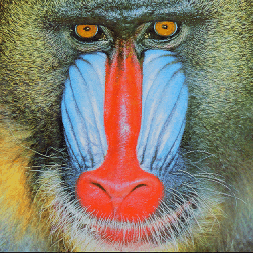
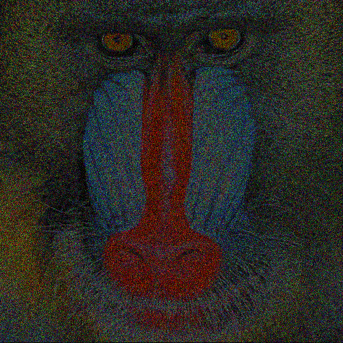

# Visual Cryptography for Color Images

## Wprowadzenie


## Opis Projektu

Wykorzystana przez nas metoda kryptografii wizualnej polega na podziale obrazka na dwa częściowo losowe, nieczytelne obrazy, które po nałożeniu odpowiednim na siebie, odsłaniają oryginalny obraz. Ta technika, zwykle stosowana do obrazów binarnych (czerń i biel), została tutaj rozszerzona na kolorowe zdjęcia, zwiększając tym samym pulę zdjęć możliwą do przesłania. Nasz projekt wykorzystuje model kolorów RGB oraz schemat kryptograficzny (2, 2), który wymaga obu części do odszyfrowania obrazu.


## Instalacja


```sh
git clone https://github.com/AdamRopelewski/VisualCryptographyForColorImages.git
cd VisualCryptographyForColorImages
pip install -r requirements.txt
```

## Użycie


### Szyfrowanie Obrazu

Chcesz ukryć obraz przed wścibskimi oczami? Szyfruj go.


### Deszyfrowanie Obrazu

Masz dwie części i chcesz odsłonić prawdę? Oto jak to zrobić.


## Przykłady

Spójrz na te przykłady. Każdy z nich opowiada historię, ukrywa tajemnicę.
<p align="center">
  
</p>

<p align="center">
  
</p>

<p align="center">
  
</p>

<p align="center">
  
</p>

## Twórcy
* **Adam Ropelewski:** 
* **Dawid Maliszewski:** 
* **Sebastian Matejak:**


